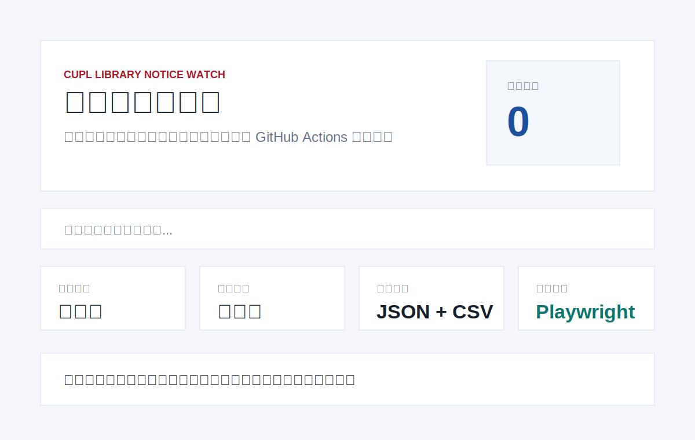

# CUPL Library Notice Watch

[中文说明](README.zh-CN.md)

Unofficial daily archive and dashboard for public notices and service updates from China University of Political Science and Law Library.



## What It Tracks

- Target site: `https://lib.cupl.edu.cn/`
- Notice page: the public library homepage and notice-like links.
- Section: `图书馆公开信息`.

The site currently blocks this environment with an access-restriction page. The scraper uses a Playwright browser context, records diagnostics in `data/meta.json`, and will archive matching notice links when the site is reachable from the runner.

## Quick Start

```bash
pip install playwright
python -m playwright install chromium
python3 scraper.py 20
python3 -m http.server 8000
```

Open `http://localhost:8000`.

## Data Files

- `data/notices.json`: merged historical notices.
- `data/notices.csv`: spreadsheet-friendly export.
- `data/history/YYYY-MM-DD.json`: notices seen during each run.
- `data/meta.json`: update time, source URLs, diagnostics and totals.

## GitHub Actions

`.github/workflows/update.yml` installs Playwright Chromium, runs the scraper every day, and commits changed files under `data/`.

## Disclaimer

This is an unofficial archive of public web information only. It does not bypass access controls, does not collect private data and does not represent China University of Political Science and Law.

## License

MIT
